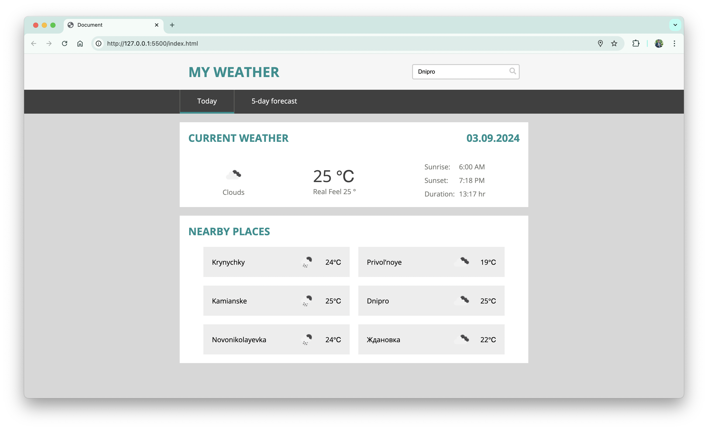
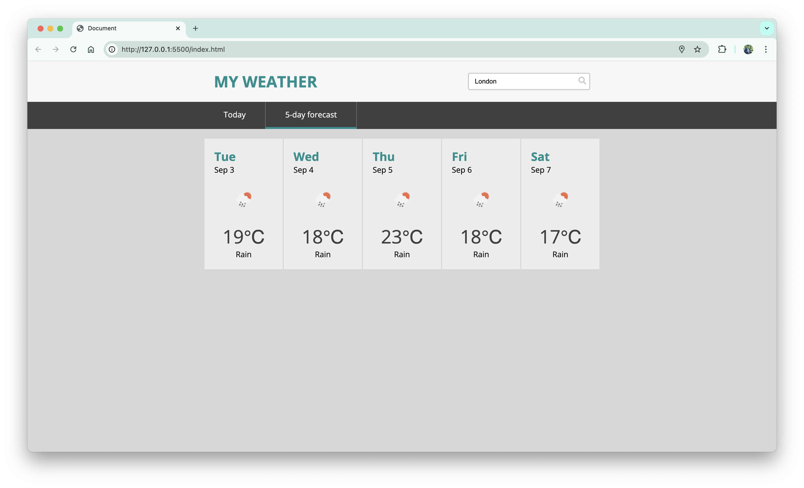

# Weather Dashboard ☀️

This project is a weather dashboard that provides current weather information and a 5-day forecast for a given city. The dashboard also displays weather data for nearby cities and provides a user-friendly interface for accessing and interacting with weather information.



## Features

- **Current Weather:** View the current weather conditions for your selected city, including temperature, weather description, sunrise, sunset, and duration of daylight. 🌡️
- **5-Day Forecast:** Get a detailed 5-day weather forecast with daily summaries and temperature data. 🌦️
- **Hourly Forecast:** Check the weather every 3 hours for a more detailed view of the upcoming weather. 🕒
- **Nearby Cities:** See weather information for cities near the selected city. 🌍
- **Error Handling:** Display an error message if the weather data for the specified city cannot be found. ❌

## Technologies Used

- **HTML:** For structuring the webpage. 🖥️
- **CSS:** For styling and responsive design. 🎨
- **JavaScript:** For dynamic functionality and AJAX requests. 💻
- **jQuery:** For simplifying DOM manipulation and AJAX requests. 📜
- **OpenWeatherMap API:** For fetching weather data. ☁️
- **Google Maps API:** For geolocation and nearby cities data. 🗺️



## How It Works

1. **Initialization:** On page load, the dashboard initializes and fetches weather data for the city based on the user's input or geolocation. 🚀
2. **Weather Data Fetching:** The `Forecast` class handles requests to the OpenWeatherMap API to get current weather and 5-day forecast data. 🌧️
3. **Displaying Weather Data:** The `Interface` class updates the user interface with the fetched weather data, including current weather, 5-day forecast, and nearby cities' weather. 📊
4. **User Interaction:** Users can switch between different tabs to view current weather, 5-day forecast, or hourly data. They can also view weather data for nearby cities. 🔄

## Setup and Installation

1. Clone the repository:

    ```bash
    git clone <repository-url>
    ```

2. Navigate to the project directory:

    ```bash
    cd <project-directory>
    ```

3. Open `index.html` in your web browser to view the weather dashboard.

## API Keys

- **OpenWeatherMap API Key:** Replace `"*************************************************"` with your own API key.
- **Google Maps API Key:** Replace `"*************************************************"` with your own API key.
